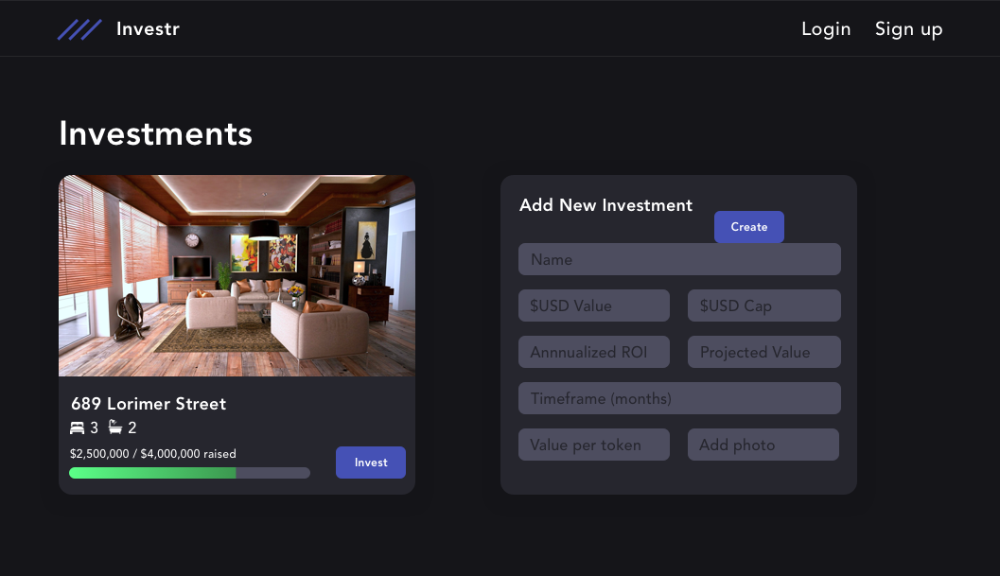

# Investr | Asset Tokenization

fractionalized investment for real estate properties, digital content, or NFTs



## demo
- initial idea - tokenize real estate
- then became fractionalized asset investment
- ERC1155 - tokenized nfts

- smart contracts - so creators can 1) tokenize assets 2) share an ENS address so users can invest DAI 3) investors can claim profits from assets once creators fund them with sponsor money

- skale network - enables quick, cheap transactions. probably only Main and AssetRegistry should exist on mainnet, and all asset tokens minted in sidechain. Once we want to enable secondary markets....

## setup
make sure you have .env file with
```
PRIVATE_KEY=
SKALE_URL=http://157.230.148.184:8035
REACT_APP_SKALE_URL=http://157.230.148.184:8035
```

create contracts.json file in root directory and `src/json` with content `{}`

```
npm install

rm -rf build
truffle compile

echo "{}" | tee -a contracts.json src/json/contracts.json
truffle migrate --network skale --reset
```

to run transactions that add assets to the registry and uploads files to Skale
```
truffle exec scripts scripts/assets.js --network skale
```

what you should see
```
carlos:eth-invest$ truffle exec scripts/assets.js --network skale
Using network 'skale'.

assets.js ------
using web3 on network: skale
setting coinbase as: 0xdcf8acaa9f47586ce15136f4b172c8eec93fe863
[ '0xDcF8ACaA9f47586CE15136f4B172C8eec93fe863' ]
initialized contracts
link to asset image on skale network: DcF8ACaA9f47586CE15136f4B172C8eec93fe863/asset1-prod-3
adding property asset...
added record, id: 1
Result {
  '0': '0xDcF8ACaA9f47586CE15136f4B172C8eec93fe863',
  '1': '0x4d21E85E47682f6bF382acF99C9e21129d1Ad729',
  '2': false,
  '3': false,
  '4': 'DcF8ACaA9f47586CE15136f4B172C8eec93fe863/asset1-prod-3',
  owner: '0xDcF8ACaA9f47586CE15136f4B172C8eec93fe863',
  tokenAddress: '0x4d21E85E47682f6bF382acF99C9e21129d1Ad729',
  filled: false,
  funded: false,
  fileURL: 'DcF8ACaA9f47586CE15136f4B172C8eec93fe863/asset1-prod-3' }
link to asset image on skale network: DcF8ACaA9f47586CE15136f4B172C8eec93fe863/creative-prod-3
```

(prob not working) to run transaction that shows investment lifecycle
```
truffle exec scripts scripts/invest.js --network skale
```

start the app (barebones)
```
npm run start --network skale
```

## Inspiration
Originally something meant for real estate and providing an option to invest in otherwise too expensive assets, but that space is too complicated. Slowly became the idea to give people the chance to monetize their digital content and give back to their social media following at the same time by letting followers purchase shares of sponsored content so that once the sponsorship money comes in, creators can disperse some of it to the original backers
